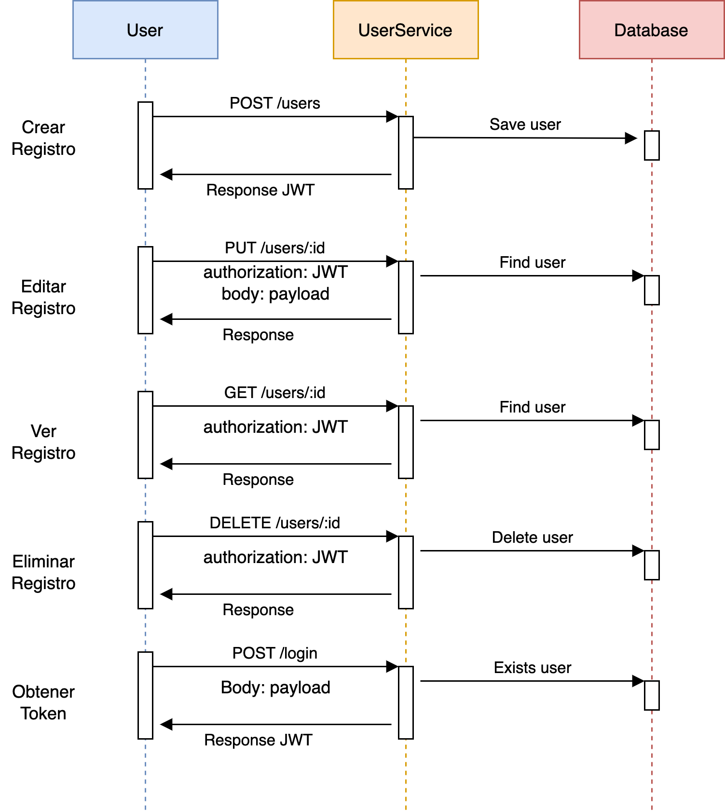
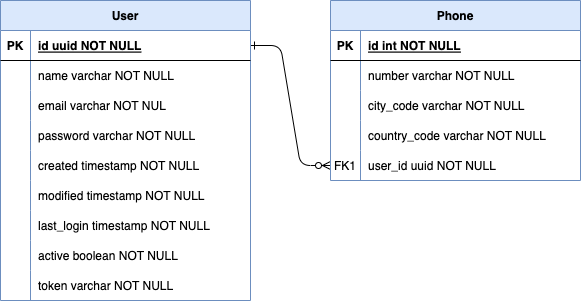

# User Service

Es un servicio que permite crear usuarios y realizar operaciones como actualizar, eliminar y actualizar.

## Componentes utilizados

- Java 11
- Spring Boot
- Base de datos H2
- Documentación Swagger
- Autentación basado en JWT

## Instalar

Para ejecutar el proyecto debe seguir los siguientes pasos:

1. Clonar el proyecto: `git clone https://github.com/ajclopez/userapp-service.git`
2. Moverse al directorio: `cd userapp-service`
3. Ejecutar: `mvn spring-boot:run`

Una vez que se inicia el proyecto, puede acceder a la GUI de Swagger y a la consola H2 mediante las siguientes rutas:
- Documentación: `http://localhost:8080/api/swagger-ui/index.html`
- Base de datos: `http://localhost:8080/api/h2-console`

## Configuración

Las configuraciones se encuentran en el archivo **application.properties**:

* **spring.datasource.username:** Usuario de la base de datos
* **spring.datasource.password:** Contraseña de acceso a la base de datos
* **user.secret.token:** Clave que permite firmar los JWTs
* **user.password.validation:** Expresión regular para validar la contraseña
* **server.servlet.context-path:** Permite definir el contexto de la aplicación
* **server.port:** Permite definir el puerto de la aplicación

## Ejemplos

Registrar un usuario: 
`POST /api/users`
```json
{
  "name": "Juan Rodriguez", 
  "email": "juan@rodriguez.org", 
  "password": "hunter2", 
  "phones": [
    {
      "number": "1234567", 
      "citycode": "1", 
      "contrycode": "57"
    }
  ]
}
```

Obtener token de acceso:
`POST /api/login`
```json
{
  "email": "juan@rodriguez.org",
  "password": "hunter2"
}
```

## Diagramas

Diagrama de secuencia API Rest:



Relación de base de datos:



